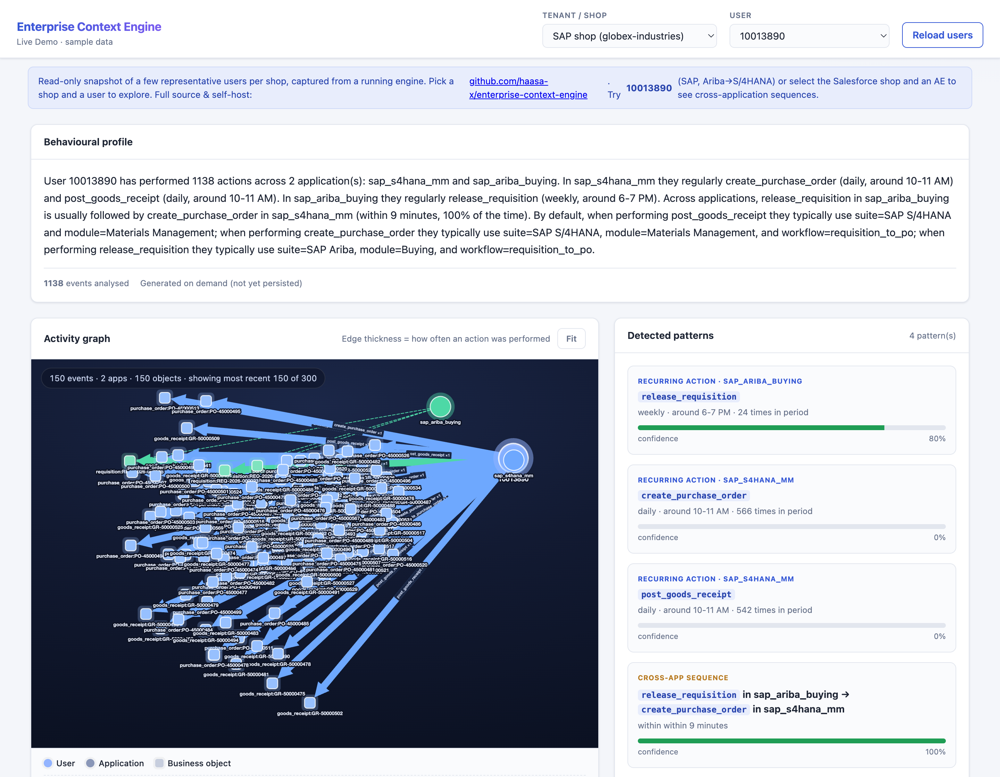
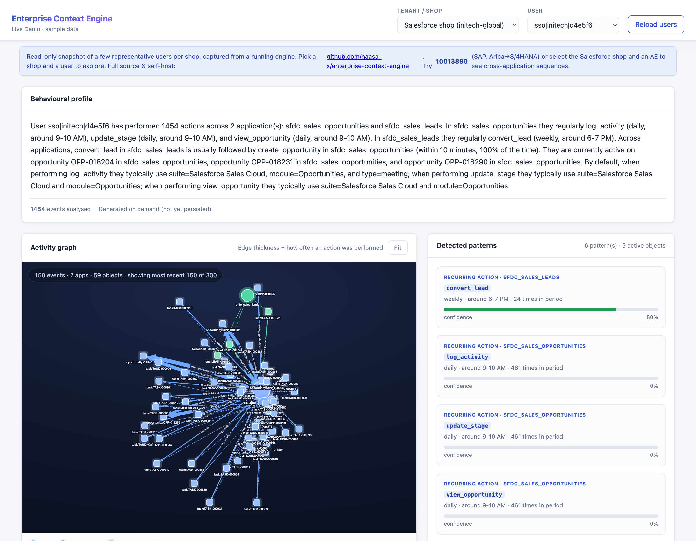
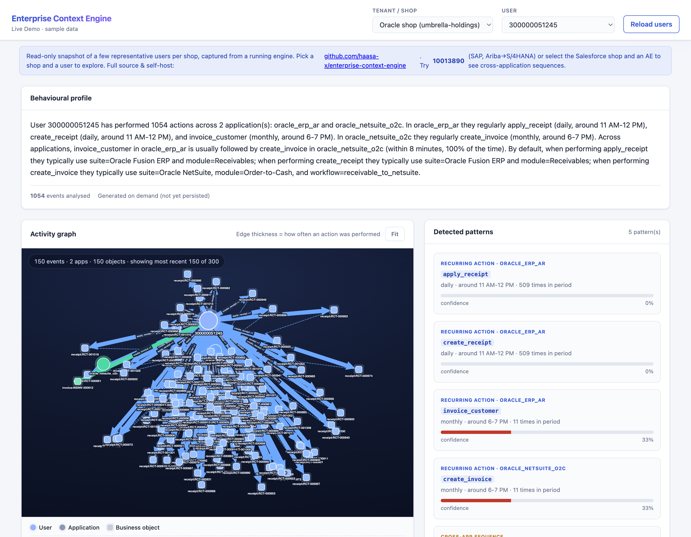

# Enterprise Context Engine

An open-source, vendor-neutral service that answers two questions: given this
user and this trigger, what are they most likely trying to do right now
(`resolve-intent`), and who is this user and how do they work (`get-profile`)?

It ships with realistic, full-stack seed data for three archetypal enterprise
buyers — **SAP**, **Salesforce**, and **Oracle** shops — so you can watch the
graph, profiler, and predictions light up on day one.

## Live demo

**▶ [Explore the interactive demo](https://haasa-x.github.io/enterprise-context-engine/)**
— the real admin graph viewer running entirely in your browser against a
read-only snapshot of a few representative users per shop. No install, no
backend. Pick a shop and a user to see their behavioural profile, activity
graph, detected patterns, and cross-application sequences.

[](https://haasa-x.github.io/enterprise-context-engine/?tenant=globex-industries&user=10013890)

<sub>Above: a SAP procurement user whose Ariba requisitions flow into S/4HANA
purchase orders — surfaced as a 100%-confidence cross-app sequence.</sub>

| Salesforce shop | Oracle shop |
|---|---|
| [](https://haasa-x.github.io/enterprise-context-engine/?tenant=initech-global&user=sso%7Cinitech%7Cd4e5f6) | [](https://haasa-x.github.io/enterprise-context-engine/?tenant=umbrella-holdings&user=300000051245) |

The demo is a static snapshot; to drive the full engine with live ingestion,
run it locally (below).

Context Engine collects structured user-activity events from enterprise
applications — Jira, SAP SuccessFactors, Concur, or anything else — via a
push-based SDK, pull-based connectors, or log listeners, stores them in a
temporal knowledge graph where behavioural patterns thicken as repeated
actions reinforce the same edges, and exposes that history through REST
endpoints and equivalent MCP tools, so any LLM or agent can call it without
custom integration work. It is invisible plumbing, not a chatbot or a
dashboard: there is no LLM, no embedding model, and no vector database
anywhere in the ingestion or prediction path — predictions are graph
traversal and keyword scoring, grounded in things the user actually did. A
scheduled profiler turns each user's graph into a natural-language behavioural
summary using a deterministic, LLM-free template backend by default.

## Quick start

```bash
git clone https://github.com/haasa-x/enterprise-context-engine.git
cd enterprise-context-engine
docker compose up
```

Once the API is ready (`GET http://localhost:8000/readyz` returns `200`):

```bash
curl -X POST http://localhost:8000/v1/events \
  -H "Content-Type: application/json" \
  -d '{
    "schemaVersion": "1.0.0",
    "eventId": "11111111-1111-1111-1111-111111111111",
    "tenantId": "acme-corp",
    "applicationId": "jira",
    "applicationInstanceId": "acme-jira-01",
    "environment": "production",
    "eventTimestamp": "2024-08-18T08:00:00Z",
    "actor": {"nativeUserId": "hr_manager001", "userIdType": "employee_id"},
    "action": {"type": "view_sprint_board", "category": "read"},
    "object": {"objectType": "sprint", "objectId": "SPRINT-7"},
    "source": {"connector": "native-sdk", "connectorVersion": "1.0.0"}
  }'

curl -X POST http://localhost:8000/v1/resolve-intent \
  -H "Content-Type: application/json" \
  -d '{
    "tenantId": "acme-corp",
    "userId": "hr_manager001",
    "userIdType": "employee_id",
    "trigger": {"source": "email", "text": "Sprint Q3 2024 closes tomorrow"}
  }'
```

The second call returns a ranked list of predicted intents, each with a
confidence score and the signals (keyword match, recency, frequency) behind
it.

### See thick patterns immediately

Rather than wait months for real activity to accumulate, load one of the
bundled datasets and explore it right away.

**Enterprise shops.** Three full-stack tenants model how large enterprises
actually deploy their suites — every product broken into its real modules, each
driven by role-appropriate personas, with cross-application workflows that
surface as sequences in the graph:

| Shop | Tenant ID | Stack |
|---|---|---|
| **SAP** | `globex-industries` | SuccessFactors · S/4HANA · Ariba · Concur |
| **Salesforce** | `initech-global` | Sales · Service · Marketing · CPQ · Experience Cloud |
| **Oracle** | `umbrella-holdings` | Fusion HCM · ERP · SCM · CX · NetSuite |

```bash
python -m samples.shops.generate generate --shop all   # writes samples/shops/data/*.json
python -m samples.shops.generate load --shop sap        # POSTs to the engine under its tenant id
```

The generated JSON (~37 MB across the three shops) is git-ignored and fully
reproducible from the generators. See
[samples/shops/README.md](samples/shops/README.md) and the design writeup in
[SHOP_DATA_PLAN.md](SHOP_DATA_PLAN.md).

**Small demo.** A lighter dataset — five users across three apps under tenant
`acme-corp`:

```bash
python -m samples.data.seed_events generate                 # writes seed_events.json
python -m samples.data.seed_events load --tenant acme-corp   # POSTs it in batches
```

Then open the admin graph-viewer at <http://localhost:3000>, pick a shop from
the **Tenant / shop** dropdown, and explore each user's graph (thicker edges =
more frequent actions), timeline, detected patterns, and generated profile.

## Architecture

```
┌────────────────┐  ┌────────────────┐  ┌────────────────┐
│  Native SDK    │  │  Connectors    │  │  Log listeners │
│  (push)        │  │  (pull)        │  │  (tail/parse)  │
└───────┬────────┘  └───────┬────────┘  └───────┬────────┘
        │                   │                   │
        v                   v                   v
┌─────────────────────────────────────────────────────────┐
│                 Context Engine Platform                  │
│  FastAPI ingestion -> structured graph writer (no LLM)   │
│  -> Neo4j (temporal, tenant-scoped, patterns thicken)    │
│  -> prediction service (graph traversal + keywords)      │
│  -> scheduled profiler (template NLQ, no LLM by default) │
│  -> REST API + MCP server (resolve_intent, get_profile)  │
└─────────────────────────────────────────────────────────┘
        │                                   │
        v                                   v
┌──────────────────┐                ┌──────────────────┐
│  LLM / Agents /  │                │  Admin graph     │
│  Enterprise Apps │                │  viewer (:3000)  │
└──────────────────┘                └──────────────────┘
```

See [docs/architecture.md](docs/architecture.md) for the full diagram, the
graph data model, and the multi-tenancy guarantees.

## API reference

| Endpoint | Purpose |
|---|---|
| `POST /v1/events` | Ingest a single event |
| `POST /v1/events/batch` | Ingest up to 100 events |
| `POST /v1/resolve-intent` | Predict a user's current intent |
| `GET /v1/users/{userId}/profile` | Pre-generated behavioural profile + dominant patterns |
| `GET /v1/admin/users` | List a tenant's users (admin UI) |
| `GET /v1/admin/users/{userId}/events` | A user's recent events (admin UI); bounded by `days` and `limit` |
| `GET /healthz` | Liveness probe |
| `GET /readyz` | Readiness probe (checks Neo4j connectivity) |
| `GET /metrics` | Prometheus metrics |

All endpoints are tenant-scoped: read endpoints take the tenant from the
`X-Tenant-Id` header, write endpoints from the body `tenantId` (which must
match the header when both are present). See
[docs/protocol-guide.md](docs/protocol-guide.md) for the event schema every
`POST /v1/events` payload must conform to.

## Behavioural profiles

A scheduled profiler reads each user's graph, detects recurring patterns
(daily/weekly/monthly cadences, cross-application sequences, active objects,
default parameters), and writes a natural-language summary onto the user.
`GET /v1/users/{userId}/profile` returns it, or `404 insufficient_data` for
users with fewer than ten events. The default generator is a deterministic,
LLM-free template; an LLM backend is an interchangeable v1.5 option selected
by `CE_PROFILE_GENERATOR_BACKEND`. Generate profiles for a tenant's active
users on demand:

```bash
python -m context_engine.profiler.scheduler acme-corp
```

## MCP server

The same capabilities are exposed as two MCP tools — `resolve_user_intent`
and `get_user_profile` — so MCP-aware agents get identical results with no
custom integration:

```bash
python -m context_engine.mcp.server --transport stdio
```

## SDKs

```python
from context_engine_sdk import ContextEngineClient

with ContextEngineClient(base_url="http://localhost:8000") as client:
    client.emit({
        "tenantId": "acme-corp",
        "applicationId": "my-app",
        "applicationInstanceId": "my-app-prod",
        "environment": "production",
        "actor": {"nativeUserId": "user@acme.com", "userIdType": "email"},
        "action": {"type": "update_issue_status", "category": "update"},
        "object": {"objectType": "issue", "objectId": "PROJ-123"},
        "source": {"connector": "native-sdk", "connectorVersion": "1.0.0"},
    })
```

```ts
import { ContextEngineClient } from "context-engine-sdk";

const client = new ContextEngineClient({ baseUrl: "http://localhost:8000" });
await client.emit({
  tenantId: "acme-corp",
  applicationId: "my-app",
  applicationInstanceId: "my-app-prod",
  environment: "production",
  actor: { nativeUserId: "user@acme.com", userIdType: "email" },
  action: { type: "update_issue_status", category: "update" },
  object: { objectType: "issue", objectId: "PROJ-123" },
  source: { connector: "native-sdk", connectorVersion: "1.0.0" },
});
```

See [docs/sdk-guide.md](docs/sdk-guide.md) for both SDKs in full.

## Three ways to get events in

| Path | When to use it | Guide |
|---|---|---|
| **SDK push** | You own the app's code | [docs/sdk-guide.md](docs/sdk-guide.md) |
| **Connector** | The app only exposes webhooks/polling/exports | [docs/connector-guide.md](docs/connector-guide.md) |
| **Log listener** | The app only writes logs | [docs/log-listener-guide.md](docs/log-listener-guide.md) |

`connectors/jira/` is the reference connector. Each path has a runnable
example under `samples/`:

- `samples/task-tracker/` — a tiny FastAPI app that emits events via the
  Python SDK (Path 1)
- `samples/log-simulator/` — a log generator plus a listener that transforms
  log lines into events (Path 3)
- `samples/data/seed_events.py` — six months of realistic activity for five
  users across three apps, loadable via `POST /v1/events/batch`
- `samples/shops/` — full-stack SAP / Salesforce / Oracle seed-data generators
  (see [samples/shops/README.md](samples/shops/README.md))

## Admin UI

`admin/graph-viewer/` is a self-contained graph viewer served on port 3000 by
`docker compose up`. Pick a tenant from the **Tenant / shop** dropdown (the
three enterprise shops are built in, plus an "Other…" entry for any custom
tenant), and scope how much history loads with the **History window** filter
(30 / 90 / 180 days). Per user it shows: the activity graph with
frequency-weighted edges (capped for very busy users so the render stays fast),
an activity timeline, detected-pattern cards, the natural-language profile, and
a live event feed. See [docs/admin-ui-guide.md](docs/admin-ui-guide.md).

## Tech stack

| Layer | Technology |
|---|---|
| API framework | FastAPI + Uvicorn |
| Graph database | Neo4j Community Edition 5.x |
| SDKs | Python (httpx only) and Node (native `fetch` only) |
| MCP server | Official MCP Python SDK |
| Containerization | Docker + Docker Compose |
| Testing | pytest + pytest-asyncio + testcontainers |
| Linting / types | ruff, mypy (strict) |
| License | Apache 2.0 |

No PostgreSQL, no Redis, no message queue, no embedding models or vector
database, no GPU requirements — see
[docs/adr/001-neo4j-over-alternatives.md](docs/adr/001-neo4j-over-alternatives.md)
for why.

## Contributing

See [CONTRIBUTING.md](CONTRIBUTING.md).

## License

[Apache License 2.0](LICENSE).
